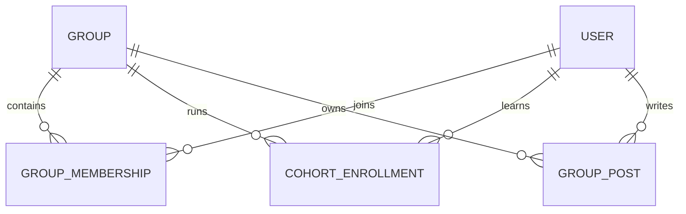
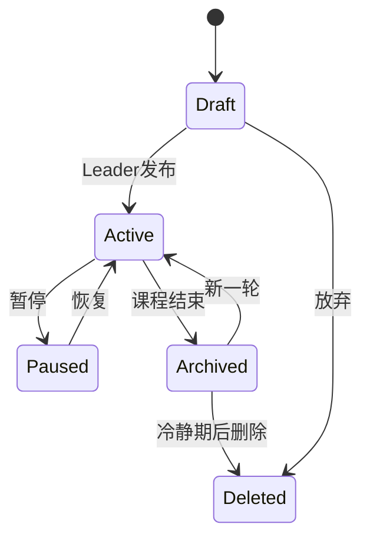

# 用户角色与多小组权限模型

## 1. 核心原则

1. 角色属于“小组成员关系”，不是用户的全局身份。
2. 同一用户可在 A 组任 Leader、在 B 组任 Member。
3. 小组默认不可被搜索，只能通过邀请加入。
4. 成员只能看其所在组及被明确分享给该组的内容。
5. 私人笔记、私人祷告和 AI 对话默认只有本人可见。
6. 平台管理员不因技术权限而自动获得查看私密正文的业务权限。
7. 所有跨用户读取都必须由数据库行级安全策略执行，不能只依靠前端隐藏按钮。

## 2. 角色定义

### 2.1 平台级角色

| 角色 | 职责 | 不得做 |
|---|---|---|
| User | 使用课程、参加小组 | 访问未加入的小组 |
| Content Reviewer | 审核课程、来源、神学与 AI 策略 | 查看成员私密日记和 AI 对话 |
| Safety Moderator | 处理举报与高风险事件 | 无事件依据浏览所有小组 |
| Platform Admin | 用户、系统、审计和配置管理 | 以管理便利为由常态查看内容 |
| Owner | 最少人数持有的紧急系统权限 | 日常使用超级权限 |

### 2.2 小组级角色

| 角色 | 说明 |
|---|---|
| Leader | 创建和管理本组课程节奏、成员与讨论；不是平台认证牧者 |
| Co-leader | 协助管理，但不能移除唯一 Leader 或删除小组 |
| Member | 学习、打卡、参与本组讨论 |
| Observer | 经成员同意后观察课程进度；默认不能查看私人内容或发起管理动作 |

MVP 可只实现 `Leader`、`Member` 两种组内角色；数据模型保留 `Co-leader`、`Observer`。

## 3. 多小组关系模型

`GROUP_MEMBERSHIP` 是权限核心，包含：

- `user_id`
- `group_id`
- `role`
- `status`
- `joined_at`
- `invited_by`
- `accepted_covenant_at`

任何“Leader 能否查看/修改”的判断都必须同时匹配当前 `group_id`。

## 4. 可见范围模型

每条用户内容必须显式带一个可见范围：

| 范围 | 可见者 | 典型内容 |
|---|---|---|
| `private` | 仅作者 | 灵修笔记、私人祷告、AI 对话 |
| `leader_only` | 作者 + 本组 Leader | 请求 Leader 跟进的问题 |
| `group` | 作者 + 当前组活跃成员 | 讨论帖、公开打卡感想 |
| `selected_groups` | 作者 + 被选小组 | 用户主动跨组分享的见证 |
| `moderation_hold` | 作者 + 获授权安全人员 | 被举报内容；普通组员不可见 |

MVP 不提供 `public`。

同一条内容不得因用户同时参加多个小组而自动跨组显示。跨组分享必须产生独立的 `content_share` 记录，列出目标小组和授权时间。

## 5. 权限矩阵

| 动作 | 作者 | 本组 Member | 本组 Leader | 其他组 Leader | 内容审核者 | 安全审核者 |
|---|---:|---:|---:|---:|---:|---:|
| 查看自己的私人笔记 | ✓ | — | — | — | — | 仅事件授权 |
| 查看组内讨论 | ✓ | ✓ | ✓ | — | — | 仅事件授权 |
| 删除自己的讨论 | ✓ | — | 可隐藏，不可冒充作者删除 | — | — | 可隔离 |
| 查看成员完成状态 | ✓ | 仅自己的 | ✓，仅本组汇总/授权明细 | — | — | — |
| 查看成员 AI 对话 | ✓ | — | — | — | — | 仅高风险事件且留痕 |
| 邀请成员 | — | — | ✓ | — | — | — |
| 移除成员 | — | — | ✓，不得删除其私人数据 | — | — | 可安全处置 |
| 发布已审核课程 | — | — | 选择课程并排期 | — | ✓ | — |
| 修改课程正文 | — | — | — | — | ✓，经发布流程 | — |
| 查看举报正文 | 举报者可看状态 | — | 仅组务举报摘要 | — | — | ✓ |
| 导出个人数据 | ✓ | — | — | — | — | — |
| 删除账号 | ✓ | — | — | — | — | 依法保留最少安全记录 |

## 6. Leader 面板的数据最小化

Leader 可以看到：

- 本组成员名单和角色；
- 每人本周是否开始、是否完成；
- 成员主动共享的回答与代祷事项；
- 需要跟进但由成员明确提交的请求；
- 组级完成率和活动趋势。

Leader 不可以看到：

- 私人灵修全文；
- 私人祷告全文；
- 未分享的草稿；
- AI 完整聊天记录；
- 用户参加的其他小组；
- 平台推断的“软弱点、顺服度、风险人格”。

## 7. 邀请与加入

1. Leader 创建小组并接受 Leader 盟约。
2. 系统生成一次性或限时邀请链接。
3. 受邀者只能看到小组名称、Leader 显示名、使命边界和隐私摘要。
4. 用户注册/登录后确认加入，并单独选择是否允许组内显示真实姓名、头像和时区。
5. 邀请链接过期、撤销或达到人数上限后失效。
6. 退出小组后，用户的私人内容仍归用户；组内已发布内容按删除/匿名化规则处理。

## 8. 小组生命周期

- `Paused`：成员可读历史，不能新增内容；
- `Archived`：保留学习记录，可导出，不接受新成员；
- `Deleted`：先进入 30 天冷静期；之后删除组配置，用户私人记录不随组强制删除；
- 安全冻结独立于上述状态，由 `safety_status` 控制。

## 9. RLS 策略要求

所有面向客户端的业务表默认开启 RLS，并采用“无明确策略即拒绝”：

- `groups`：仅活跃成员可读；
- `group_memberships`：成员读本组必要字段，Leader 管理本组；
- `posts/comments`：仅目标组活跃成员可读；
- `private_entries`：仅 `auth.uid() = user_id`；
- `leader_shared_entries`：作者及目标组 Leader 可读；
- `ai_threads/messages`：仅作者；安全读取走独立审计函数；
- `course_content`：只读已发布版本；
- `review_records`：仅内容审核角色；
- `audit_events`：仅受限服务端写入，不向普通客户端开放。

`service_role` 密钥只允许在服务端使用，不得进入浏览器、客户端包、日志或错误信息。

## 10. 权限验收的零容忍用例

- A 组 Leader 无法通过修改 URL、API 参数或 GraphQL/REST 请求读取 B 组数据。
- 成员退出 A 组后立即失去 A 组非本人内容访问权。
- Leader 无法读取成员 `private` 或 AI 对话，即使知道记录 ID。
- 内容审核者无法读取用户讨论或日记。
- 安全审核读取必须关联 `safety_case_id`，并写入不可变审计记录。
- 用户角色变化只影响目标小组，不影响其在其他组的角色。
- 客户端禁用按钮不能代替服务端授权校验。

