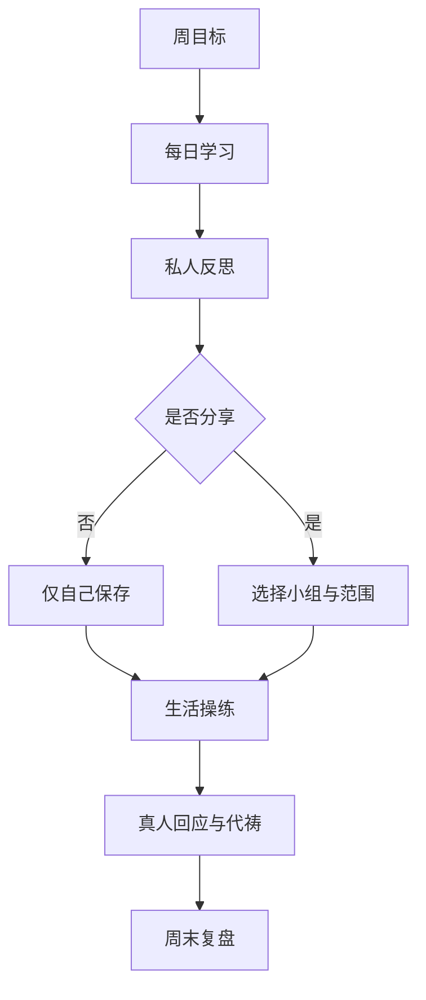

# 完整用户旅程

## 1. 旅程设计原则

- 先建立信任，再要求填写资料；
- 先进入熟人小组，再进入课程；
- 先让用户选择“私密/分享”，再保存灵修内容；
- 每次 AI 使用都让用户知道哪些内容会被发送；
- 以真实操练和彼此连接为目标，不以连续打卡制造羞耻；
- 每条路径都指向本地教会，而不是平台依赖。

## 2. 核心北极星行为

不是“打开 App”或“连续打卡”，而是：

> 一名成员在一周内完成至少一个经文学习、一个生活操练、一次自愿组内分享或回应，并参加一次由真人 Leader 组织的复盘。

## 3. 学员首次加入旅程

### 阶段 A：收到熟人邀请

用户看到：

- 邀请人的姓名/显示名；
- 小组名称及四周计划；
- “这是辅助平台，不替代本地教会”；
- 默认私密、谁能看到什么；
- 不要求立即下载 App。

用户行动：打开邀请链接，选择“了解并加入”或“暂不加入”。

验收：

- 未登录时不暴露成员名单和讨论内容；
- 邀请链接有有效期、次数和撤销状态；
- 不用“属灵不顺服”等语言催促加入。

### 阶段 B：注册与同意

最少字段：

- 邮箱；
- 显示名；
- 密码或魔法链接；
- 所在时区；
- 已满 18 岁确认；
- 同意服务条款、隐私政策；
- 单独明确同意处理宗教信仰相关数据。

可选字段：

- 头像；
- 本地教会连接状态：“已有稳定教会/正在寻找/暂不回答”；
- 所属地区，只到国家或时区，不收精确地址。

禁止首发收集：

- 身份证件；
- 精确住址；
- 政治立场；
- 实名教会地址；
- 受洗证明；
- 医疗或心理诊断；
- 无产品必要性的性与家庭隐私。

### 阶段 C：边界导览

用三张卡完成：

1. 这是小组学习工具，不是教会；
2. 私人记录默认只有自己能看；
3. AI 是有出处的学习助手，不是牧者或神谕。

用户必须完成一次可见范围练习：

> “这段示例笔记当前是：仅自己可见。”

### 阶段 D：进入小组

首页只展示：

- 本周课程；
- 今日任务；
- 小组下一次复盘时间；
- 最近两条本组互动；
- 一个“需要帮助？”入口。

不展示：

- 公共热榜；
- 属灵排名；
- 连续天数压力；
- 未加入小组的推荐；
- “谁最虔诚”等比较。

## 4. 学员每周循环

### 周一：进入主题

- 2–3 分钟课程导言；
- 查看本周目标和预计投入；
- 选择个人实践目标；
- Leader 发布一段真人问候。

### 周二至周五：微学习

每次 10–15 分钟：

1. 经文引用与合法阅读入口；
2. 课程摘要或已授权内容；
3. 一个理解问题；
4. 一个私人反思；
5. 一个小行动；
6. 可选 AI 提问。

用户可“今天跳过”，不出现羞耻文案；系统可提示补学，但不连环骚扰。

### 周六：组内交通

- 系统提供一个已审核分享问题；
- 用户选择纯文本、简短语音链接或“不分享”；
- 分享前再次确认可见范围；
- 成员可以回应、鼓励、表示愿意代祷；
- 不提供匿名攻击、转发到组外或一键公开。

### 周日：复盘与本地教会连接

- 回顾完成的操练，不显示未完成惩罚；
- 记录一句感恩和一个下周行动；
- 提醒参加本地教会敬拜/团契；
- Leader 发送组内总结；
- 可跳转外部会议链接，平台不自动录制。

## 5. AI 学习旅程

### 正常问题

1. 用户从课程内点“问 AI”；
2. 页面显示将发送的课程上下文，不默认附加私人日记；
3. 用户输入问题；
4. 系统进行风险分类和检索；
5. AI 用已审核来源回答；
6. 回答显示来源卡、置信边界和“与 Leader 讨论”按钮；
7. 用户选择是否保存为私人笔记。

### 无法依据资料回答

AI 明确说：

> 当前已审核课程资料不足以支持确定回答。我可以帮你整理问题、列出相关课程位置，或建议你与本地教会牧者讨论。

不得用模型常识伪造教材立场。

### 高风险问题

例如“神是不是要我离婚”“我是否没有得救”“我能不能给小组主持圣餐”：

- 不给神圣裁决；
- 重申边界；
- 提供经审核的学习材料；
- 建议联系本地教会或相应专业人士；
- 只有涉及即时人身风险时触发安全流程。

## 6. 代祷旅程

创建代祷时用户必须选择：

- 仅自己；
- 仅本组 Leader；
- 全组；
- 不保存，只用于本次个人祷告。

默认“仅自己”。代祷卡应允许：

- 设置自动过期时间；
- 标记“已蒙回应/已结束/继续代祷”；
- 随时修改可见范围；
- 删除；
- 禁止组员一键转发到其他组。

涉及第三人的代祷，应提示：

> 请避免写入未经当事人同意的姓名、疾病、婚姻、法律或其他可识别隐私。

AI 默认不读取代祷正文。用户主动要求 AI 帮助整理时，必须先单独确认。

## 7. Leader 创建小组旅程

1. 注册并完成普通用户导览；
2. 阅读并接受 Leader 盟约；
3. 创建小组：名称、简介、时区、人数上限；
4. 选择已审核课程“新生活重启营”；
5. 选择开始日和每周复盘时间；
6. 生成邀请链接；
7. 在预览模式确认成员能看到的内容；
8. 发布小组；
9. 每周使用 Leader 面板跟进；
10. 第四周归档或开启下一轮。

Leader 不需要：

- 上传神学证明；
- 获得平台“牧师认证”；
- 读取成员私人内容；
- 逐个电话销售或手工统计 Excel。

## 8. Leader 每周旅程

### 开课前

- 查看课程带领提示；
- 查看本课风险和不应追问的隐私；
- 发布真人开场；
- 确认外部会议时间。

### 进行中

- 看到成员是否开始/完成，不看私人正文；
- 回应公开分享；
- 对成员主动提交的 `leader_only` 请求进行关怀；
- 必要时提醒暂停公开讨论并转向本地牧养/专业帮助。

### 周末

- 使用系统生成的“仅基于组级聚合数据”的周报草稿；
- 人工修改后发布；
- 不允许 AI 对单个成员做属灵画像；
- 查看组内反馈和下周准备事项。

## 9. 多小组用户旅程

首页设小组切换器。任何操作都显示当前上下文：

- 顶部显示当前小组名称；
- 发帖前显示“将分享到：A 组”；
- 切组后课程、讨论和 Leader 身份同时切换；
- A 组 Leader 权限不会带入 B 组；
- 跨组分享必须逐个选择目标组并再次确认。

防误发机制：

- 颜色/图标区分不同小组；
- 发布前确认目标；
- 30 秒撤回；
- 最近切组后首次发帖强提醒。

## 10. 退出、导出与删除旅程

用户可以：

- 随时退出任一小组；
- 下载个人课程进度、私人笔记和本人发帖；
- 删除单条内容；
- 申请删除账号；
- 撤回非必要的数据处理同意。

退出小组时提供三种已发布组内内容处理：

1. 保留显示名；
2. 匿名化为“已退出成员”；
3. 删除正文，仅保留讨论结构。

如果内容正关联安全举报，系统可以依法和按政策保留最小必要副本，并告知用户保留范围。

## 11. 举报与求助旅程

举报入口覆盖：

- 属灵控制或恐吓；
- 异端/秘密启示式操控；
- 金钱、投资、借贷或捐款诈骗；
- 性骚扰、虐待或不当私信；
- 泄露隐私；
- 自伤或伤人风险；
- 垃圾信息。

流程：

1. 用户选择类别并可提交证据；
2. 系统给出紧急程度和本地求助提示；
3. 生成 `safety_case`；
4. 只有获授权人员可读取必要内容；
5. 采取隐藏、冻结邀请、暂停成员或关闭小组；
6. 向举报人提供状态，不透露不必要的他人隐私；
7. 所有读取和处置写入审计日志。

## 12. 内测结束旅程

第四周后：

- 学员完成 5 分钟反馈；
- Leader 完成 15 分钟复盘；
- 系统生成匿名聚合指标；
- 每组决定归档、休息或进入下一课程；
- 产品团队只联系明确同意被访谈的人；
- 不把未付费或未续学解释为属灵失败。

