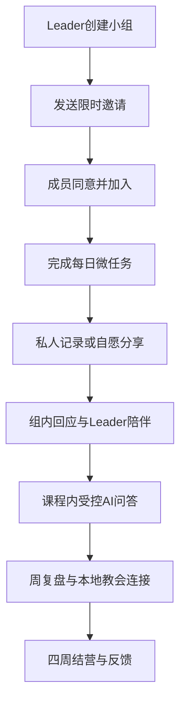

# AI 门徒训练平台正式 PRD

## 0. 文档信息

| 项目 | 内容 |
|---|---|
| 版本 | 1.0 |
| 状态 | MVP 开发候选 |
| 产品负责人 | 创始人 |
| 首发市场 | 海外，首批简体中文熟人小组 |
| 首发端 | 响应式 Web / PWA |
| 内测规模 | 3–5 组，20–40 名成年人 |
| 内测周期 | 4 周 |
| 预算约束 | 前 90 天现金投入不超过人民币 3,000 元 |
| 产品使命 | 以课程、操练、熟人小组和受控 AI 辅助门徒成长，同时坚定连接本地教会 |

## 1. 背景

目标用户常面临：

- 身处不同城市和国家，原有线下门训小组难以持续；
- 年轻用户不习惯长期单向听课，需要提问、互动与个人节奏；
- 微信、会议软件等通用工具无法将课程、实践、讨论和成长记录形成连续结构；
- 开放互联网中的神学观点互相冲突，初信者难以分辨来源和核心/宗派差异；
- 现有数字产品往往是个人内容消费，难以形成熟人小组的真实守望；
- AI 容易给出无来源、过度确定或越过教会与牧养边界的回答。

本产品的机会不是再做一个“圣经聊天机器人”，而是把获得授权、经过线下验证的门徒训练课程，变成一个由真人关系承载、AI 受限辅助的持续学习系统。

## 2. 问题陈述

> 分散在各地、彼此认识的基督徒缺少一个独立、私密、结构化的线上空间，使他们能围绕同一门训课程持续学习、实践、分享和互相守望，又不会让技术平台取代本地教会或让 AI 取得属灵权威。

## 3. 目标

### 3.1 产品目标

1. 让熟人小组在 10 分钟内完成建组和邀请。
2. 让成员每天用 10–15 分钟完成一个有意义的学习或实践。
3. 让同一账号安全参与多个小组，权限不串组。
4. 让 Leader 看到参与进度和主动分享，而非偷窥私人灵修。
5. 让 AI 对课程问题提供可追溯答案，并在神学、圣礼和危机问题上守界。
6. 完成一轮四周真实内测，形成是否继续扩展的证据。

### 3.2 业务目标

MVP 阶段不以收入为首要成功标准，先验证：

- 小组能否持续四周；
- 用户是否感到被连接而非被监控；
- Leader 是否减少组织成本；
- 授权课程是否能自然转为数字体验；
- AI 是否真正帮助理解且没有越界。

验证通过后再测试：

- 免费个人使用 + 小组发起人赞助；
- 每组/每期付费；
- 个人进阶订阅；
- 教会或机构版。

支付不进入首发 P0。

## 4. 非目标

- 建立线上教会；
- 替代本地教会敬拜、牧养、纪律、圣礼和服事；
- 公开传教内容广场；
- 陌生人社交；
- AI 牧师、AI 先知或全能属灵陪伴；
- 教派裁判；
- 受洗、会籍、按立或属灵成熟认证；
- 自建视频会议；
- 首发全世界所有语言和 42 课。

## 5. 用户与场景

### Persona A：重新连接的资深信徒

- 35–55 岁；
- 曾参与线下门训，朋友已分散；
- 希望恢复共同操练；
- 对隐私、教义准确和关系真实性要求高。

核心任务：

> “我想和原来的弟兄姊妹重新组成一个稳定小组，不受地域限制地一起学习和代祷。”

### Persona B：忙碌的年轻基督徒

- 22–35 岁；
- 信息源过载，不愿持续听单向讲道；
- 希望能提问、讨论、按自己的时间学习；
- 容易被连续打卡和说教劝退。

核心任务：

> “我需要短而有结构的学习，并能安全地问问题、听到熟人的真实回应。”

### Persona C：小组 Leader

- 有线下带组经验，但不是技术人员；
- 不想每天手工催促、发文件和统计；
- 需要知道谁掉队，但不愿也不应看到私人日记。

核心任务：

> “我需要一套已经排好的课程和温和的跟进工具，让我把精力放在真人关怀上。”

### Persona D：慕道/初信者

- 对福音有兴趣，但对术语和宗派差异陌生；
- 需要可信来源，也需要被尊重；
- 不应被平台或 Leader 催迫做受洗、奉献等决定。

MVP 首轮不以 D 为主，因为需更成熟的危机、神学和本地教会转介机制；数据模型为后续保留。

## 6. 核心价值主张

| 用户 | 价值 |
|---|---|
| 学员 | 课程不是“看完”，而是每天可做、有人同行、可安全提问 |
| Leader | 有结构、有进度、有带领提示，但没有越权窥探 |
| 小组 | 熟人关系跨地域持续，历史和学习成果不散落在多个聊天工具 |
| 教会 | 产品反复将用户引回本地教会，而非争夺会众 |
| 内容作者 | 课程以版本、来源、权限和审核方式被忠实数字化 |

## 7. 产品范围

### 7.1 MVP 主流程

### 7.2 首发课程

《新生活》前四课：

1. 基督徒的新生活；
2. 新生活与读经；
3. 新生活与祷告；
4. 新生活与灵修。

改编形式：

- 每周一课；
- 每周 6–7 个微任务；
- 每日 10–15 分钟；
- 一次真人小组复盘；
- 一个本地教会连接行动。

## 8. 详细需求

### FR-01 身份认证与同意

- 邮箱认证；
- 成人确认；
- 敏感数据单独同意；
- 条款版本记录；
- 时区；
- 个人资料最小化。

优先级：P0。

### FR-02 多小组

- 受邀加入；
- 一个账号多个小组；
- 每组独立角色；
- 小组切换器；
- 退出与归档；
- 无公开搜索。

优先级：P0。

### FR-03 课程排期

- 已发布课程模板；
- Leader 设置开始日；
- 按成员时区展示；
- 任务完成；
- 可跳过；
- 发布版本不可静默覆盖。

优先级：P0。

### FR-04 内容可见范围

- 私人、仅 Leader、当前组；
- 默认私人；
- 分享前确认；
- 编辑、撤回、删除；
- 不自动跨组。

优先级：P0。

### FR-05 讨论与代祷

- 周主题；
- 帖子、评论、回应；
- 代祷状态与过期；
- 第三人隐私提醒；
- 举报与隐藏。

优先级：P0。

### FR-06 Leader 工具

- 本组成员；
- 完成状态；
- 主动共享；
- 组级统计；
- 真人总结；
- 外部会议链接；
- 带领注意事项。

优先级：P0。

### FR-07 AI 学习助手

- 仅基于审核课程；
- 课程上下文入口；
- 引用；
- 置信状态；
- 风险分类；
- 拒答与转介；
- 用户主动保存。

优先级：P0，但排在权限、课程和讨论之后。

### FR-08 内容治理

- 来源；
- 授权范围；
- 内容版本；
- 神学/编辑/安全审核；
- AI 可用标志；
- 发布/撤回。

优先级：P0 可先用种子脚本和只读后台；完整编辑器 P1。

### FR-09 安全治理

- 举报；
- 安全案件；
- 有限访问；
- 暂停成员/小组；
- 审计；
- 紧急提示。

优先级：P0。

### FR-10 用户权利

- 数据导出；
- 删除；
- 撤回非必要同意；
- 退出小组；
- 内容可见范围修改。

优先级：P0。

## 9. 关键业务规则

1. 用户未完成敏感数据同意，不得加入小组或写入信仰内容。
2. 课程正文只有 `published` 版本可被普通用户读取。
3. 只有 `ai_approved=true` 的内容块可进入 AI 检索。
4. 任何角色权限按 `group_id` 计算。
5. Leader 不能查看 `private` 记录和 AI 对话。
6. 涉及洗礼、圣餐的内容必须显示本地教会提示。
7. AI 无来源时不得生成确定答案。
8. 小组没有公开状态；邀请是唯一加入路径。
9. 用户退出组后立即撤销读取权。
10. 平台不以连续天数、积分或排名衡量属灵成熟。

## 10. 体验原则

- 移动端优先；
- 界面安静、温暖、克制；
- 不用“你落后了”“你让小组失望了”等羞耻式提醒；
- 打卡语言使用“完成/稍后/跳过”；
- 隐私选择用人能理解的句子，不只用锁图标；
- AI 回答与真人消息视觉上明显区分；
- 每课预计时间透明；
- 删除、退出和投诉容易找到。

## 11. 内容与品牌语气

语气：

- 尊重；
- 以圣经与历史性信仰为根基；
- 不卖弄神学术语；
- 不用恐惧制造转化；
- 不承诺“七天改变生命”；
- 不以平台增长等同福音果效。

避免：

- “AI 告诉你神的旨意”；
- “全球唯一正统”；
- “不上线就会属灵退后”；
- “打卡多少天证明你爱主”；
- “离开你的教会，加入真正的小组”。

## 12. 指标与埋点

只记录枚举和时间，不记录正文。

关键事件：

- `invite_opened`
- `invite_accepted`
- `consent_completed`
- `group_joined`
- `lesson_started`
- `task_completed`
- `task_skipped`
- `entry_shared`
- `group_post_created`
- `support_reaction_created`
- `ai_question_submitted`
- `ai_answer_grounded`
- `ai_answer_refused`
- `report_submitted`
- `group_archived`
- `course_completed`
- `feedback_submitted`

事件属性仅包含去标识化 ID、课程/任务 ID、组规模区间、语言、时区区间和状态枚举。

## 13. 内测方案

### 13.1 招募

- 3–5 个现有熟人小组；
- 每组 4–8 人；
- 成人；
- 至少一名愿意每周真人复盘的 Leader；
- 不以高危心理/医疗或冲突小组作为第一批测试。

### 13.2 节奏

- 开始前：30 分钟 Leader 导览；
- 第 1 周：观察注册、加入与首任务；
- 第 2 周：观察隐私理解、讨论质量；
- 第 3 周：开放受控 AI；
- 第 4 周：完成课程和访谈；
- 结束后：一周内修复关键问题。

AI 可以先以功能开关限定 1–2 个组，降低风险。

### 13.3 反馈

学员问卷：

- 是否更容易持续学习？
- 是否知道谁能看到内容？
- 是否感到被支持而非被监控？
- AI 是否有帮助、是否越界？
- 是否更愿意参与本地教会？

Leader 访谈：

- 组织成本是否降低？
- 哪些数据真正有用？
- 是否忍不住想查看私人内容？
- 课程节奏是否符合真实小组？
- 哪些安全情形没有覆盖？

## 14. 商业化假设

内测免费。达到以下门槛后再做支付实验：

- 四周完成率 ≥40%；
- 至少 3 名 Leader 主动要求开下一期；
- 至少 30% 的参与者愿意推荐给另一个熟人小组；
- 无严重权限和 AI 安全事故。

首个付费测试优先：

1. 小组发起人自愿赞助每期；
2. 免费基础小组 + 进阶课程包；
3. 个人支持者订阅。

避免：

- 用属灵压力催捐；
- 按祷告次数或 AI“属灵建议”收费；
- 付费解锁“神旨意”；
- Leader 从成员奉献抽佣。

## 15. 依赖与待决策

| 项目 | 状态 | 阻塞 |
|---|---|---|
| 教材作者授权 | 用户确认已取得 | 需归档书面范围 |
| 圣经译本 | 未最终确定 | 上线正文前确认 |
| 产品名/域名 | 未确定 | 不阻塞原型 |
| 隐私与条款 | 草案待法律复核 | 阻塞真实公测 |
| 首批 Leader | 待确定 | 阻塞内测 |
| AI 供应商 | 可抽象 | 不阻塞非 AI 模块 |
| 安全值班责任人 | 待明确 | 阻塞举报上线 |

## 16. 风险与缓解

| 风险 | 缓解 |
|---|---|
| 产品逐渐变成网络教会 | 产品宪章、功能禁区、圣礼零权限、本地教会指标 |
| Leader 形成属灵控制 | 盟约、最小数据、举报、暂停和审计 |
| 多组数据泄露 | RLS、按组角色、自动权限测试、零容忍发布闸门 |
| AI 神谕化 | 受控 RAG、来源不足拒答、高风险分类、固定边界 |
| 课程宗派性被当作普世结论 | A/B/C 三层标注和人工审核 |
| 宗教敏感数据泄露 | 默认私密、AI 情境同意、无正文日志、删除导出 |
| 开发范围失控 | 只做四周课程、P0 闸门、P2 禁止项 |
| 内容版权不完整 | 课程与经文/诗歌/图片逐项授权登记 |
| 创始人单人维护过载 | 托管服务、无视频、无支付、少后台、功能开关 |

## 17. 发布标准

进入熟人内测前：

- P0 非 AI 主流程端到端可用；
- 权限和 RLS 自动测试通过；
- 使命、信仰、隐私、条款、Leader 盟约已发布；
- 四周课程经过作者/神学/编辑确认；
- 举报责任人和流程明确；
- AI 红队测试通过，或 AI 功能保持关闭；
- 备份恢复完成一次；
- 真实用户数据不进入开发环境；
- 每个功能有关闭开关或回滚方案。

