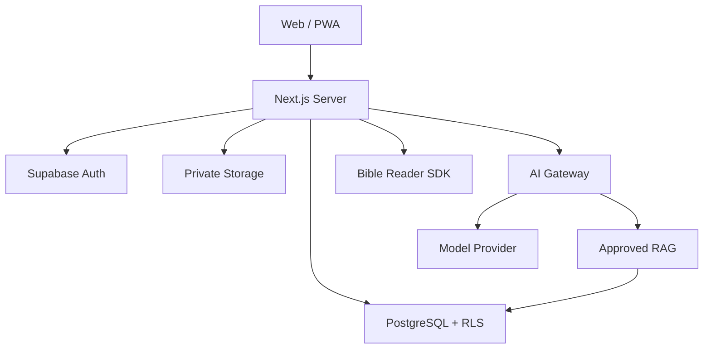

# 数据库与技术架构

## 1. 架构目标

- 一名 Vibe Coding 开发者可以维护；
- 前 90 天低成本；
- 海外 Web/PWA 快速上线；
- 多小组权限由数据库强制执行；
- 敏感信仰数据默认私密；
- AI 与核心产品解耦，可随时关闭或更换供应商；
- 从第一天支持课程版本、来源和审核。

## 2. 推荐技术栈

| 层 | 推荐 |
|---|---|
| 前端/服务端 Web | Next.js App Router + TypeScript |
| UI | Tailwind CSS + 可访问组件库 |
| 数据库 | Supabase 托管 PostgreSQL |
| 认证 | Supabase Auth，邮箱登录 |
| 权限 | PostgreSQL Row Level Security |
| 文件 | Supabase Storage，私有桶 + 签名 URL |
| 向量检索 | PostgreSQL `pgvector`，只存审核课程块 |
| 后台任务 | 托管 Cron/队列；MVP 尽量少用 |
| 部署 | Vercel 或同等级海外托管平台 |
| 错误监控 | 可配置脱敏的错误监控 |
| 邮件 | 支持事务邮件的供应商；正文不含敏感内容 |
| AI | 服务端 Provider Adapter；OpenAI-compatible 或其他供应商 |
| 圣经阅读 | 优先评估 YouVersion Platform SDK/Reader；未确认前只显示引用 |

官方架构依据：

- Next.js App Router 适合把服务端与前端路由放在一个代码库；
- Supabase 官方明确建议客户端访问数据库时使用 RLS，并可将 RLS 与 Auth 组合；
- Supabase 的 pgvector 可存储向量，且检索可结合 RLS/权限；
- YouVersion Platform 提供 Bible API/SDK/嵌入式阅读能力，可减少译本许可和自建阅读器复杂度。

不锁定具体主版本号；初始化项目时使用稳定发行版并提交 lockfile。

## 3. 系统拓扑



关键边界：

- 浏览器只持有公开客户端配置；
- `service_role` 和模型密钥仅在服务端；
- 普通业务读写尽量使用用户 JWT，让 RLS 生效；
- 只有审核、AI 服务和安全事件使用受限服务端函数；
- 私人用户内容不进入课程向量库。

## 4. 数据域

### 4.1 身份与同意

#### `profiles`

| 字段 | 类型 | 说明 |
|---|---|---|
| `user_id` | uuid PK/FK | Auth 用户 |
| `display_name` | text | 非必须实名 |
| `avatar_path` | text nullable | 私有或受控头像 |
| `timezone` | text | IANA 时区 |
| `locale` | text | `zh-CN` 等 |
| `adult_confirmed_at` | timestamptz | 成人确认 |
| `created_at` | timestamptz | 创建时间 |

#### `legal_documents`

- `id`
- `document_type`
- `version`
- `locale`
- `content_hash`
- `published_at`
- `retired_at`

#### `user_consents`

- `user_id`
- `legal_document_id`
- `consent_type`
- `granted_at`
- `revoked_at`
- `evidence_meta`：只存必要客户端/版本信息

唯一约束：一个用户对一个文档版本和同意类型一条有效记录。

### 4.2 小组

#### `groups`

- `id`
- `name`
- `description`
- `timezone`
- `member_limit`
- `lifecycle_status`
- `safety_status`
- `created_by`
- `created_at`
- `archived_at`

#### `group_memberships`

- `group_id`
- `user_id`
- `role`：leader/co_leader/member/observer
- `status`：invited/active/paused/left/removed
- `invited_by`
- `joined_at`
- `left_at`
- `leader_covenant_version`
- `accepted_covenant_at`

主键：`(group_id, user_id)`。

#### `group_invitations`

- `id`
- `group_id`
- `token_hash`
- `role_to_grant`
- `expires_at`
- `max_uses`
- `use_count`
- `created_by`
- `revoked_at`

只保存令牌哈希；原始令牌仅创建时展示。

### 4.3 课程与内容

#### `content_sources`

- `id`
- `title`
- `author`
- `source_file_ref`
- `license_scope`
- `license_evidence_path`
- `language`
- `created_at`

#### `courses`

- `id`
- `slug`
- `title`
- `audience`
- `status`

#### `course_versions`

- `id`
- `course_id`
- `version`
- `locale`
- `status`：draft/review/published/retired
- `source_id`
- `published_at`
- `created_by`

#### `modules`

- `id`
- `course_version_id`
- `sequence`
- `title`
- `estimated_minutes`

#### `lessons`

- `id`
- `module_id`
- `sequence`
- `title`
- `risk_level`
- `local_church_notice`
- `ai_policy_id`

#### `content_blocks`

- `id`
- `lesson_id`
- `sequence`
- `block_type`
- `body_json`
- `source_locator`
- `ai_approved`
- `theology_status`
- `copyright_status`

#### `scripture_refs`

- `id`
- `content_block_id`
- `osis_ref`
- `display_label`
- `translation_key`
- `licensed_text` nullable

默认不存未经许可的经文正文。

#### `content_reviews`

- `id`
- `content_version_or_block_id`
- `review_type`：theology/editorial/copyright/safety
- `reviewer_id`
- `decision`
- `notes`
- `reviewed_at`

发布规则：所需审核均通过才可发布。

### 4.4 班次、任务与进度

#### `cohorts`

- `id`
- `group_id`
- `course_version_id`
- `starts_on`
- `status`
- `meeting_url`
- `meeting_schedule`
- `created_by`

#### `cohort_lessons`

- `cohort_id`
- `lesson_id`
- `unlock_at`
- `due_at`

#### `tasks`

- `id`
- `lesson_id`
- `task_type`
- `title`
- `prompt_json`
- `is_core`
- `sequence`

#### `task_completions`

- `task_id`
- `user_id`
- `cohort_id`
- `status`：completed/skipped/reset
- `completed_at`
- `reflection_entry_id` nullable

完成记录不保存反思正文。

### 4.5 用户内容

#### `entries`

统一承载灵修笔记、反思、代祷和见证的元数据：

- `id`
- `author_id`
- `group_id` nullable
- `cohort_id` nullable
- `entry_type`
- `visibility`
- `body_ciphertext` 或普通受控文本
- `status`
- `expires_at`
- `created_at`
- `updated_at`
- `deleted_at`

是否采用应用层字段加密在威胁建模后决定；MVP 至少使用托管静态加密、RLS 和私有访问。

#### `content_shares`

- `entry_id`
- `target_group_id`
- `share_scope`
- `shared_at`
- `revoked_at`

#### `group_posts`

- `id`
- `group_id`
- `author_id`
- `cohort_id`
- `lesson_id`
- `body`
- `status`
- `created_at`
- `deleted_at`

#### `comments`

- `id`
- `post_id`
- `author_id`
- `body`
- `status`
- `created_at`

#### `reactions`

- `id`
- `target_type`
- `target_id`
- `user_id`
- `reaction_type`：encourage/praying

### 4.6 AI

#### `ai_policies`

- `id`
- `name`
- `risk_level`
- `allowed_topics`
- `blocked_topics`
- `required_notice`
- `referral_rule`
- `version`

#### `knowledge_chunks`

- `id`
- `content_block_id`
- `course_version_id`
- `chunk_text`
- `embedding`
- `ai_approved`
- `locale`
- `source_locator`

只包含课程审核内容。

#### `ai_threads`

- `id`
- `user_id`
- `group_id` nullable
- `lesson_id`
- `retention_mode`
- `created_at`
- `deleted_at`

#### `ai_messages`

- `id`
- `thread_id`
- `role`
- `body`
- `source_refs_json`
- `risk_category`
- `grounding_status`
- `model_meta_minimal`
- `created_at`

模型元数据不保存完整系统提示和密钥。

#### `ai_context_consents`

- `id`
- `thread_id`
- `user_id`
- `context_type`
- `entry_id` nullable
- `granted_at`
- `revoked_at`

### 4.7 安全与审计

#### `reports`

- `id`
- `reporter_id`
- `target_type`
- `target_id`
- `category`
- `description`
- `created_at`

#### `safety_cases`

- `id`
- `report_id`
- `severity`
- `status`
- `assigned_to`
- `resolution_code`
- `created_at`
- `closed_at`

#### `safety_case_access`

- `safety_case_id`
- `actor_id`
- `reason`
- `granted_by`
- `expires_at`

#### `audit_events`

- `id`
- `actor_id`
- `action`
- `object_type`
- `object_id`
- `purpose_code`
- `metadata_redacted`
- `created_at`

审计日志不存用户正文。

## 5. RLS 设计示例

### 5.1 组内读取

逻辑：

```sql
exists (
  select 1
  from group_memberships gm
  where gm.group_id = target.group_id
    and gm.user_id = auth.uid()
    and gm.status = 'active'
)
```

### 5.2 私人记录

```sql
author_id = auth.uid()
```

`leader_only` 不应通过一个宽松的 `entries` 策略实现，建议使用安全视图或独立分享表，确保：

- 作者可读；
- 只有目标组活跃 Leader 可读；
- 读取已撤回分享后立即失效；
- Leader 无法查询其他类型私人记录。

### 5.3 课程读取

普通用户只读：

```sql
course_versions.status = 'published'
```

AI 服务还需：

```sql
content_blocks.ai_approved = true
and content_blocks.theology_status = 'approved'
and content_blocks.copyright_status = 'approved'
```

### 5.4 安全案件

普通客户端不能直接查询安全表。服务端函数验证：

- 当前账号是安全审核角色；
- 存在未过期 `safety_case_access`；
- 读取目的与案件相符；
- 写入 `audit_event`。

## 6. API/服务边界

### 普通用户接口

- `POST /api/invitations/accept`
- `GET /api/groups/:id/home`
- `POST /api/tasks/:id/complete`
- `POST /api/entries`
- `PATCH /api/entries/:id/visibility`
- `POST /api/groups/:id/posts`
- `POST /api/reports`
- `POST /api/ai/query`
- `POST /api/data-export`
- `POST /api/account-deletion`

所有接口：

- 使用 schema 验证；
- 检查当前小组上下文；
- 写入速率限制；
- 错误信息不暴露记录是否存在；
- 不把敏感正文写入日志。

### AI Gateway

`POST /api/ai/query` 流程：

1. 验证用户和课程访问；
2. 验证 AI 使用同意；
3. 规范化问题；
4. 安全预分类；
5. 按课程版本、语言、`ai_approved` 检索；
6. 若相关性不足，返回 `insufficient`；
7. 组合不可覆盖系统规则、课程上下文和用户问题；
8. 调用模型；
9. 验证结构化输出和引用；
10. 后分类与禁用表达检查；
11. 保存最少必要记录；
12. 返回答案、出处和边界。

## 7. AI 检索设计

### 7.1 不做“全资料一锅端”

向量库按内容块切分：

- 300–700 中文字的语义块；
- 保留课程、课次、标题和原始定位；
- 问题与答案分开标注；
- 高风险块增加 `risk_level` 和固定边界；
- 宗派观点增加 `tradition_scope`；
- 圣礼内容默认 `ai_approved=false`，直到专项审核。

### 7.2 混合检索

建议：

- 关键词/经文引用匹配；
- 向量相似度；
- 课程当前上下文加权；
- 来源审核状态过滤；
- 高风险策略重排序。

MVP 可先只检索当前课程和基础信仰卡，减少错误。

### 7.3 成本控制

- 每用户每日 AI 次数上限；
- 课程摘要和问题模板缓存；
- 先小模型分类，再按需调用主模型；
- 输入只发送相关片段；
- 不生成冗长答案；
- AI 功能开关按组开放；
- 记录 token 数量但不记录敏感正文。

## 8. 圣经内容接入

优先级：

1. 完成 YouVersion Platform 申请与条款审查；
2. 若 SDK/Reader 符合产品和地区，嵌入合法阅读体验；
3. 若未获批准，仅展示经文引用并链接合法来源；
4. 只有明确授权的译本正文才进入课程块和 AI 检索；
5. 不从网络抓取受版权保护的中文译本文字。

课程作者授权不等于圣经译本授权。

## 9. 目录结构建议

```text
src/
  app/
    (public)/
    (auth)/
    (app)/
    admin/
    api/
  components/
  features/
    auth/
    groups/
    courses/
    entries/
    discussions/
    prayers/
    ai/
    safety/
  lib/
    auth/
    db/
    permissions/
    validation/
    privacy/
    observability/
  server/
    ai/
    content/
    safety/
  i18n/
supabase/
  migrations/
  seed/
  tests/
content/
  schemas/
  approved/
tests/
  unit/
  integration/
  e2e/
  security/
docs/
```

## 10. 环境分离

- `local`：合成数据；
- `preview`：合成数据，不导入真实课程完整授权内容时需谨慎；
- `staging`：少量授权测试账号；
- `production`：真实用户。

禁止：

- 把生产数据库复制到本地；
- 在开发环境使用真实祷告和日记；
- 共享生产管理员账号；
- 将密钥提交 Git。

## 11. 测试策略

### 单元测试

- 可见范围；
- 角色判断；
- 课程解锁；
- 风险分类；
- AI 输出 schema；
- 同意状态。

### 集成测试

- 邀请接受；
- 多组角色；
- 退出即时撤权；
- Leader 面板聚合；
- AI 检索过滤；
- 数据导出；
- 举报访问审计。

### 端到端

- Leader 建组到学员完成第一任务；
- 多小组切换与发帖；
- 私人笔记不被 Leader 查看；
- 圣礼提问触发边界；
- 删除账号请求。

### 安全测试

- IDOR/越权；
- RLS 绕过；
- XSS；
- 邀请令牌重放；
- 速率限制；
- 提示注入；
- 日志敏感信息；
- 管理员权限；
- 上传文件类型与签名 URL。

## 12. 可观测性

允许：

- 请求状态、延迟、路由；
- 错误代码；
- 随机用户/组 ID；
- AI token 和 grounding 状态；
- 课程/任务 ID；
- 安全动作枚举。

禁止：

- 邮箱；
- 祷告/反思/帖子正文；
- AI 问题和回答全文；
- 邀请令牌；
- 模型密钥；
- 举报证据。

错误监控发送前使用 `beforeSend` 或等价钩子脱敏。

## 13. 成本草案

在 20–40 人内测规模下：

- 前端托管：免费层起步；
- Supabase：免费层起步，关注休眠、备份和带宽限制；
- 域名：年度少量费用；
- 邮件：免费额度；
- AI：设置配额并控制在小额；
- 错误监控：免费额度；
- 支付：MVP 不接入。

当真实用户增长或需要稳定备份/SLA 时，应主动升级，不以免费层牺牲数据安全。

## 14. 部署与回滚

- 每次数据库变更必须 migration；
- migration 在 preview/staging 验证；
- 课程发布与代码部署分离；
- AI、讨论、代祷、邀请分别设置 feature flag；
- 生产发布后跑权限烟雾测试；
- 高风险回归可立即关闭 AI；
- 数据库破坏性迁移采用“扩展—迁移—收缩”，不直接删除列；
- 保留上一个可部署版本。

## 15. 技术决策记录

项目建立 `docs/adr`：

- ADR-001：Web/PWA 而非原生 App；
- ADR-002：Supabase/Postgres + RLS；
- ADR-003：角色按小组成员关系；
- ADR-004：私人内容不进入 RAG；
- ADR-005：课程版本不可变；
- ADR-006：圣经阅读通过合法 SDK/引用；
- ADR-007：AI Provider Adapter；
- ADR-008：无公开社区；
- ADR-009：MVP 不自建音视频；
- ADR-010：敏感数据日志禁区。

