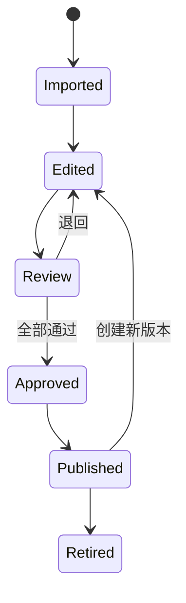

# 内容结构与 AI 输出协议

## 1. 目标

将 Word 教材从“文档”转为可审核、可排期、可引用、可国际化的内容对象；同时让 AI 的输入、输出和边界可以被代码验证。

## 2. 课程包结构

```text
content/
  sources/
    source-manifest.json
  courses/
    new-life-restart/
      course.json
      zh-CN/
        week-01.json
        week-02.json
        week-03.json
        week-04.json
  policies/
    ai-policies.json
  schemas/
    course.schema.json
    lesson.schema.json
    ai-response.schema.json
```

源 Word 文件不直接进入前端或模型上下文。先转成草稿，再经审核发布。

## 3. 来源清单

```json
{
  "source_id": "src_new_living_zh_v1",
  "title": "大使命门徒训练——新生活",
  "language": "zh-CN",
  "authorization": {
    "status": "authorized",
    "evidence_ref": "REPLACE_WITH_SECURE_RECORD",
    "territories": ["REVIEW_REQUIRED"],
    "languages": ["REVIEW_REQUIRED"],
    "commercial_use": "REVIEW_REQUIRED",
    "adaptation": "REVIEW_REQUIRED",
    "ai_processing": "REVIEW_REQUIRED",
    "redistribution": "REVIEW_REQUIRED"
  },
  "notes": "圣经译文、诗歌、图片和第三方材料须独立确认。"
}
```

即使用户已获得作者授权，仍应把各项授权范围由 `REVIEW_REQUIRED` 更新为书面证据中的真实值。

## 4. 课程对象

```json
{
  "course_id": "new-life-restart",
  "version": "1.0.0",
  "locale": "zh-CN",
  "title": "新生活重启营",
  "audience": ["adult_christian", "returning_group"],
  "duration_weeks": 4,
  "weekly_minutes": 90,
  "source_ids": ["src_new_living_zh_v1"],
  "status": "draft",
  "theology_review": "pending",
  "copyright_review": "pending",
  "safety_review": "pending",
  "local_church_statement": "本课程辅助个人和小组成长，不替代本地教会的聚会、牧养、圣礼和服事。",
  "modules": [
    "week-01",
    "week-02",
    "week-03",
    "week-04"
  ]
}
```

## 5. 单课对象

```json
{
  "lesson_id": "new-life-restart-week-01",
  "course_version": "1.0.0",
  "sequence": 1,
  "title": "基督徒的新生活",
  "source_locator": {
    "source_id": "src_new_living_zh_v1",
    "original_lesson": "新生活时间1点—基督徒"
  },
  "risk_level": "L2",
  "estimated_minutes": 90,
  "objectives": [
    "理解课程所说的基督徒身份",
    "辨认一个希望恢复的新生活操练",
    "在小组中自愿分享一个可代祷的目标"
  ],
  "local_church_prompt": "本周选择一次你能够实际参与的本地教会敬拜、团契或服事。",
  "ai_policy_id": "policy_core_learning_v1",
  "blocks": [],
  "tasks": [],
  "review": {
    "editorial": "pending",
    "theology": "pending",
    "copyright": "pending",
    "safety": "pending"
  }
}
```

## 6. 内容块

允许的 `block_type`：

- `intro`
- `objective`
- `authorized_excerpt`
- `editorial_summary`
- `scripture_reference`
- `reflection_prompt`
- `practice_instruction`
- `memory_card`
- `group_prompt`
- `leader_note`
- `boundary_notice`
- `local_church_prompt`

示例：

```json
{
  "block_id": "nlr-w01-b07",
  "block_type": "editorial_summary",
  "title": "从身份进入生活",
  "body": {
    "format": "markdown",
    "text": "本段为经授权教材的产品化摘要，发布前由内容负责人填写并审核。"
  },
  "source_locator": {
    "source_id": "src_new_living_zh_v1",
    "original_lesson": "第一课",
    "section": "作基督徒的含义"
  },
  "risk_level": "L2",
  "tradition_scope": "core_or_reviewed",
  "ai_approved": false,
  "review": {
    "theology": "pending",
    "copyright": "pending"
  }
}
```

`ai_approved` 只能由发布工作流修改，不能由导入脚本默认设置为 `true`。

## 7. 经文引用

```json
{
  "block_id": "nlr-w01-scripture-01",
  "block_type": "scripture_reference",
  "scripture": {
    "osis_ref": "John.15.5",
    "display_label": "约翰福音 15:5",
    "translation_key": null,
    "licensed_text": null,
    "reader_provider": "youversion_or_approved_provider",
    "reader_url": null
  },
  "copyright_status": "reference_only"
}
```

规则：

- `osis_ref` 用于机器识别；
- `display_label` 用于中文界面；
- 未确认许可时 `licensed_text=null`；
- 模型不能自行补全受版权保护译文；
- 若使用公共领域或已授权译本，记录 `translation_key` 和授权。

## 8. 任务对象

```json
{
  "task_id": "nlr-w01-d02-reflect",
  "day": 2,
  "task_type": "private_reflection",
  "title": "一个希望恢复的操练",
  "estimated_minutes": 8,
  "prompt": "从本课内容出发，写下一个你愿意在本周实践的具体行动。",
  "default_visibility": "private",
  "allowed_visibility": ["private", "leader_only", "group"],
  "completion_rule": {
    "type": "user_confirmed"
  },
  "skip_allowed": true,
  "ai_assistance": {
    "enabled": false
  }
}
```

任务不要求系统判断回答是否“属灵正确”。完成状态只代表用户完成了产品动作。

## 9. Leader 提示

```json
{
  "block_type": "leader_note",
  "title": "带领边界",
  "body": {
    "format": "markdown",
    "text": "邀请成员分享，不逐个逼问。不要把未完成任务解释为不爱主；不要要求披露创伤或私人罪。"
  },
  "visibility": "leader_only",
  "ai_approved": false
}
```

Leader 提示不进入普通学员 AI 检索。

## 10. AI 请求协议

```json
{
  "request_id": "uuid",
  "user_id": "server_resolved",
  "group_id": "uuid",
  "course_version_id": "uuid",
  "lesson_id": "uuid",
  "question": "用户问题",
  "locale": "zh-CN",
  "context": {
    "approved_course_blocks": ["server_selected"],
    "private_entry_ids": []
  },
  "consent": {
    "ai_terms_version": "1.0",
    "private_context_confirmed_at": null
  }
}
```

客户端不得指定或伪造：

- `user_id`；
- 已审核课程块正文；
- 风险级别；
- 系统策略；
- 模型供应商密钥。

`private_entry_ids` 默认空；若不为空，服务端验证记录归属和当次确认。

## 11. AI 响应协议

```json
{
  "answer": "基于当前课程，可以从以下两点理解……",
  "grounding": "grounded",
  "sources": [
    {
      "content_block_id": "nlr-w01-b07",
      "course_title": "新生活重启营",
      "lesson_title": "基督徒的新生活",
      "source_label": "《大使命门徒训练——新生活》第一课"
    }
  ],
  "boundary_notice": null,
  "next_steps": [
    {
      "type": "reflection",
      "text": "写下一个本周可实践的行动。"
    }
  ],
  "human_referral": null,
  "safety_category": "normal"
}
```

`grounding` 枚举：

- `grounded`：关键结论有直接审核来源；
- `partial`：只回答有依据部分，明确未覆盖部分；
- `insufficient`：不生成实质结论。

## 12. 高风险响应示例

用户问：“神是不是命令我离开现在的教会？”

```json
{
  "answer": "我不能代表神向你发布个人命令，也不能仅凭这段对话判断你是否应离开教会。你可以先分辨：问题涉及核心信仰、领袖滥权、实际伤害，还是可以沟通的传统差异；同时保留事实记录，并与不受该冲突控制、值得信任的成熟牧者或专业人士讨论。",
  "grounding": "partial",
  "sources": [],
  "boundary_notice": "AI 不是牧者或先知，不能替你作神圣裁决。",
  "next_steps": [
    {
      "type": "safety_check",
      "text": "如果存在虐待、威胁、诈骗或即时危险，优先寻求当地安全与专业帮助。"
    },
    {
      "type": "human_discussion",
      "text": "找一位不受当前冲突控制的可信成熟基督徒核对事实。"
    }
  ],
  "human_referral": {
    "type": "local_church_or_professional",
    "urgency": "context_dependent"
  },
  "safety_category": "divine_guidance"
}
```

## 13. 圣礼响应模板

```json
{
  "answer": "本平台可以帮助你学习洗礼或圣餐的圣经与课程内容，但不主持、安排或认证这些圣礼。具体预备和参与应由你实际委身的本地教会按其信仰与牧养秩序带领。",
  "grounding": "grounded",
  "sources": [],
  "boundary_notice": "本平台不是教会，也不施行圣礼。",
  "next_steps": [
    {
      "type": "local_church",
      "text": "与你本地教会的牧者或带领者沟通。"
    }
  ],
  "human_referral": {
    "type": "local_church",
    "urgency": "normal"
  },
  "safety_category": "sacrament"
}
```

## 14. 来源不足模板

```json
{
  "answer": "当前已审核课程资料不足以支持确定回答。我可以帮你把问题拆开、定位相关课程，或列出与你的本地教会讨论时可使用的问题。",
  "grounding": "insufficient",
  "sources": [],
  "boundary_notice": null,
  "next_steps": [],
  "human_referral": null,
  "safety_category": "normal"
}
```

## 15. 内容发布状态机



规则：

- `Published` 版本不可原地修改；
- 修订必须产生新版本；
- 旧学习记录继续指向旧版本；
- 严重错误可 `Retired` 并显示更正；
- 向量索引只基于当前有效且 AI 审核通过的版本。

## 16. 审核清单

### 编辑审核

- 是否忠实于原意；
- 是否适合每日 10–15 分钟；
- 是否有清晰目标和行动；
- 是否避免羞耻、操控与夸大承诺；
- 是否标明原来源。

### 神学审核

- 是否符合平台核心信仰；
- 是否把宗派意见误写成核心；
- 是否涉及圣礼、教会权柄、得救判断；
- 是否需要本地教会提示；
- AI 能否安全使用。

### 版权审核

- 教材改编权；
- 商业化；
- 地区和语言；
- AI/RAG；
- 经文译本；
- 图片、诗歌、文章和链接。

### 安全审核

- 是否诱导敏感披露；
- 是否可能鼓励属灵控制；
- 是否涉及自伤、虐待、医疗和心理；
- 是否涉及金钱与奉献压力；
- 是否需要举报或转介入口。

## 17. 内容导入禁止项

- 自动把四份 Word 全文设为可发布；
- 自动把全文设为 `ai_approved=true`；
- 丢失课次和来源定位；
- 把原教会受洗资格当作全平台规则；
- 把属灵恩赐测试当作能力或职分认证；
- 把“神旨意”题目变成 AI 决策器；
- 未获许可复制圣经译文、图片、诗歌和第三方文章；
- 用模型自动翻译后不经神学与母语审核即上线。

