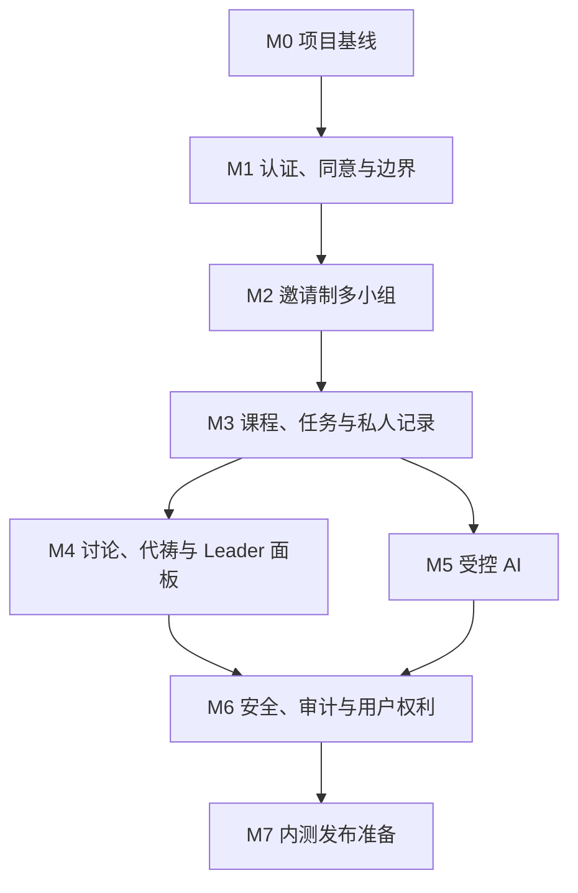

# MVP 开发阶段全景图：

To continue this session, run codex resume 019fb219-0ba1-7a03-84db-5b63446af633

## 1. 总览

本项目 MVP 按 `09_Codex可执行开发任务书.md` 拆分为 **8 个阶段**：

| 阶段 | 名称 | 当前状态 | 核心交付 |
|---|---|---|---|
| M0 | 项目基线 | 已完成 | Next.js 工程、质量工具、UI 基线、ADR、产品文档副本 |
| M1 | 认证、同意与边界 | 已完成 | Supabase Auth 基础、成人确认、法律同意、版本化边界页面 |
| M2 | 邀请制多小组 | 已完成 | 小组、成员关系、邀请 token、RLS、多小组隔离 |
| M3 | 课程、任务与私人记录 | 下一阶段 | 课程版本、四周排期、每日任务、进度、私人记录与分享 |
| M4 | 讨论、代祷与 Leader 面板 | 未开始 | 组内讨论、代祷、Leader 跟进面板、站内通知 |
| M5 | 受控 AI | 未开始 | AI Provider Adapter、审核 RAG、风险分类、带出处回答 |
| M6 | 安全、审计与用户权利 | 未开始 | 举报、安全案件、审计、数据导出、账号删除 |
| M7 | 内测发布准备 | 未开始 | 安全回归、性能验证、备份恢复、内测开关、导览 |

## 2. 阶段依赖图



## 3. 当前进度

截至当前开发状态：

- 已完成：M0、M1、M2；
- 下一步：M3；
- 尚未开始：M4、M5、M6、M7。

当前已具备：

- 可运行 Next.js Web/PWA 工程；
- 认证、成人确认和同意流程；
- 版本化使命、信仰、边界、隐私、条款、社区守则和 AI 说明页面；
- 邀请制小组数据模型；
- 小组成员关系；
- 多小组角色隔离；
- 邀请 token hash 存储；
- 小组、成员、邀请相关 RLS；
- 小组相关页面和服务端动作。

当前尚未具备：

- 课程内容；
- 课程排期；
- 每日任务；
- 学习进度；
- 私人记录；
- 组内讨论；
- 代祷；
- Leader 面板；
- AI 问答；
- 举报与审计；
- 数据导出；
- 账号删除自助化；
- 内测发布检查。

## 4. 每阶段说明

### M0：项目基线

目标：

- 建立可运行、可测试、可继续迭代的工程基础。

已完成：

- Next.js App Router；
- TypeScript 严格模式；
- Tailwind CSS；
- ESLint；
- Prettier；
- Vitest；
- Playwright；
- CI 基线；
- `.env.example`；
- `docs/adr`；
- `docs/product`；
- 移动端优先公共首页；
- 公共法律页面占位。

总结报告：

```text
docs/M0_PROJECT_BASELINE_REPORT.md
```

### M1：认证、同意与边界

目标：

- 建立用户进入产品前的身份、成人确认、法律同意和平台边界基础。

已完成：

- Supabase helper；
- `profiles`；
- `legal_documents`；
- `user_consents`；
- 基础 RLS；
- 邮箱注册；
- 邮箱登录；
- 退出登录；
- 密码恢复入口；
- 成人确认；
- 服务条款同意；
- 隐私政策同意；
- 敏感数据处理同意；
- 营销同意默认关闭；
- 版本化使命、信仰、边界、隐私、条款、社区守则和 AI 说明页面；
- 未完成必需同意前阻断进入后续流程。

总结报告：

```text
docs/M1_AUTH_CONSENT_BOUNDARIES_REPORT.md
```

### M2：邀请制多小组

目标：

- 建立熟人小组最小闭环，并确保多小组权限隔离。

已完成：

- `groups`；
- `group_memberships`；
- `group_invitations`；
- 小组角色枚举；
- 成员状态枚举；
- 小组生命周期状态；
- 小组安全状态；
- 小组相关 RLS；
- 防止移除唯一 Leader；
- Leader 创建小组；
- Leader 编辑小组；
- Leader 归档小组；
- Leader 创建邀请；
- 邀请预览；
- 邀请接受；
- 邀请撤销；
- 成员列表；
- 成员退出；
- Leader 移除成员；
- 邀请 token 只保存 hash；
- 无公开小组目录。

总结报告：

```text
docs/M2_GROUPS_INVITATIONS_REPORT.md
```

### M3：课程、任务与私人记录

目标：

- 建立四周课程学习闭环，并引入默认私密的用户记录。

计划交付：

- `content_sources`；
- `courses`；
- `course_versions`；
- `modules`；
- `lessons`；
- `content_blocks`；
- `scripture_refs`；
- `content_reviews`；
- `ai_policies`；
- `cohorts`；
- `cohort_lessons`；
- `tasks`；
- `task_completions`；
- `entries`；
- `content_shares`；
- Leader 设置课程开始日期；
- 四周课程排期；
- 每周课程页；
- 课次页；
- 每日微任务；
- 完成/跳过任务；
- 个人进度；
- 私人记录；
- 主动分享给当前组或仅 Leader；
- 撤回分享；
- 删除记录。

关键边界：

- 不导入未授权经文译文正文；
- 不导入教材全文；
- 私人记录默认 `private`；
- Leader 不能读取私人正文；
- AI 默认不能读取私人记录；
- 不显示组员排行榜。

下一步建议：

```text
下一步建议2到3.md
```

### M4：讨论、代祷与 Leader 面板

目标：

- 在课程和私人记录基础上，建立小组互动和 Leader 跟进能力。

计划交付：

- `group_posts`；
- `comments`；
- `reactions`；
- 组内按周讨论；
- 评论；
- 鼓励回应；
- 愿意代祷回应；
- 举报入口；
- Leader 隐藏不当内容；
- 代祷事项；
- `private`、`leader_only`、`group` 三种代祷范围；
- 代祷过期、继续、结束、已回应；
- Leader 面板；
- 成员列表；
- 本周未开始/进行中/完成摘要；
- 主动分享内容；
- `leader_only` 请求；
- 组级趋势；
- 站内温和通知。

关键边界：

- 不提供公开祷告墙；
- 不提供站外公开分享按钮；
- Leader 面板不显示私人笔记；
- Leader 面板不显示 AI 对话；
- 通知不包含敏感正文。

### M5：受控 AI

目标：

- 建立只依据已审核课程内容、带出处、可拒答、可关闭的 AI 学习助手。

计划交付：

- AI Provider Adapter；
- `knowledge_chunks`；
- 审核 RAG；
- 课程内容向量索引；
- 风险分类；
- 高风险固定边界；
- 来源不足拒答；
- 结构化 AI 输出；
- 引用回到课程块；
- 用户主动保存为私人记录；
- AI 隐私说明；
- 每次附加私人内容前确认；
- 日志不保存 AI 问答正文。

关键边界：

- AI 不是牧师、先知或神谕；
- AI 不裁决神旨意；
- AI 不判断得救状态；
- AI 不主持或认证圣礼；
- 私人记录不自动进入 AI 上下文；
- 私人记录不进入课程 RAG；
- 高风险测试必须通过。

### M6：安全、审计与用户权利

目标：

- 建立举报、安全案件、审计、数据导出和账号删除能力。

计划交付：

- `reports`；
- `safety_cases`；
- `safety_case_access`；
- `audit_events`；
- 举报帖子、成员、小组；
- 安全案件状态；
- 案件分配；
- 有限审核访问；
- 隐藏内容；
- 暂停成员；
- 冻结邀请；
- 管理操作审计；
- 数据导出；
- 账号删除申请；
- 删除冷静期；
- 讨论结构匿名化；
- 安全案件例外。

关键边界：

- 普通管理员不能随意浏览敏感正文；
- 安全人员读取案件必须留痕；
- 审计记录不能由普通管理员修改；
- 导出只包含用户本人数据；
- 删除流程必须保留必要安全和审计例外。

### M7：内测发布准备

目标：

- 完成真实内测前的安全、性能、备份、导览和开关准备。

计划交付：

- 全部 RLS 表检查；
- Alice/Bob/Carol/Dave 权限矩阵回归；
- IDOR 测试；
- XSS 测试；
- CSRF 检查；
- 邀请 token 重放测试；
- 管理员 MFA 检查；
- 密钥扫描；
- 日志敏感内容扫描；
- AI 提示注入测试；
- 移动端主要页面性能检查；
- 慢网络验证；
- 空状态和失败重试；
- 备份确认；
- 恢复演练；
- 功能开关；
- Leader 导览；
- 用户帮助页；
- 举报责任人；
- 四周反馈表。

关键边界：

- 未完成安全回归不进入真实内测；
- 未确认备份恢复不进入真实内测；
- 未确认举报负责人不开放讨论；
- 未确认 AI 红线测试不开放 AI；
- 未确认授权不导入完整课程或经文正文。

## 5. 关键路线

推荐继续按以下顺序推进：

1. M3：课程、任务、私人记录；
2. M4：讨论、代祷、Leader 面板；
3. M5：受控 AI；
4. M6：举报、审计、导出、删除；
5. M7：安全回归与内测发布。

## 6. 当前最重要的下一步

进入 M3 前，最重要的是确认内容授权和隐私边界：

- 《新生活》前四课是否允许产品化改编；
- 是否允许 AI/RAG；
- 是否允许商业化；
- 是否允许再分发；
- 是否允许展示经文译文正文；
- 如果不确定，经文只显示引用；
- 私人记录是否需要字段级加密；
- 谁负责神学审核；
- 谁负责版权审核。

## 7. 阶段文档索引

| 文档 | 说明 |
|---|---|
| `docs/M0_PROJECT_BASELINE_REPORT.md` | M0 总结报告 |
| `docs/M1_AUTH_CONSENT_BOUNDARIES_REPORT.md` | M1 总结报告 |
| `docs/M2_GROUPS_INVITATIONS_REPORT.md` | M2 总结报告 |
| `下一步建议0到1.md` | M0 到 M1 建议 |
| `下一步建议1到2.md` | M1 到 M2 建议 |
| `下一步建议2到3.md` | M2 到 M3 建议 |
| `09_Codex可执行开发任务书.md` | 原始阶段任务书 |

